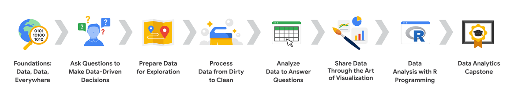

## <center> Análise de Dados do Google </center> 

### Sabe o que todas as empresas têm em comum? 
Todas elas usam dados! Todas precisam de analistas de dados para ajudar a melhorar os processos, identificar e tomar decisões. <br>

### O que são dados?
Dados são um coleção de fatos. E essa coleção pode incluir números, imagens, vídeos, palavras, medidas, observações e outros. Após ter os dados, a análise é a coleta, transformação e organização de dados para tirar conclusões, fazer previsões e impulsionar a tomada de decisões informada. Dados estão em todos os lugares. <br>

`Segundo The Economist, os dados são como o recurso mais valioso do mundo.`	<br>

### O que um analista de dados faz?
Um analista de dados é alguém que coleta, transforma e organiza dados para ajudar a tomar decisões informadas.

### Divisão 

- ``` Ask = perguntar```
- ```Process = preparar```
- ```Analyse = analisar```
- ```share = compartilhar```
- ```act = agir``` <br>
<br>

<ins>Limpeza de dados é o coração e a alma dos dados.</ins> 

### Visão Geral



1. Fundamentos: Dados, dados, em toda parte
2. Faça pergunta para tomar tomada de decisões com base em dados
3. Preparar dados para exploração
4. Processar dados sujos e limpos
5. Analisar dados para responder a perguntas
6. Compartilhe dados por meio da arte da visualisação
7. Análise de dados com programação R
8. Trabalho de conclusão de curso do Google Analytics


