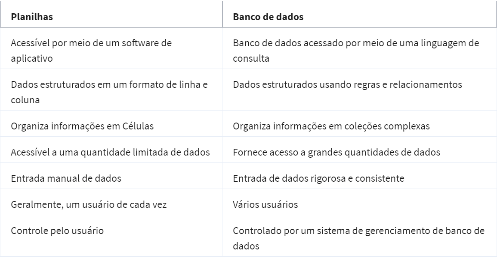

### 
 Ciclo de vida dos dados 

O ciclo de vida dos dados é planejar, capturar, gerenciar, analisar, arquivar e destruir.  

*Planejamento* - Antes de começar um projeto de análise, durante o planejamento a empresa decide que tipo de dados precisa, como serão gerenciados ao longo do seu ciclo de vida, quem será o responsável por eles e os melhores resultados.  
*Capturar dados* - Aqui os dados são coletados de várias fontes diferentes e trazidos para organização.  

`Banco de dados é uma coleção de dados armazenados em um sistema de computador`

*Gerencimaneto* - Como cuidar dos dados? Onde armazenar? Quais ações tomadas para garantir que sejam mantidos de forma correta? Essa fase é muito importante para a limpeza de dados.  
*Analisar* - Os dados são usados para resolver problemas, tomar grandes decisões e apoiar as metas de negócios.  
*Arquivamento* - Armazenar dados em um local onde eles ainda estejam disponíveis, mas não possam ser usados novamente.  
*Destruição* - É importante destruir os dados depois de usados para proteger informações privadas de uma empresa, como os dados privados sobte seus clientes.  
Esse é o ciclo de vida dos dados. 

### Variações do Ciclo de vida dos dados 
O ciclo de vida dos dados fornece um framework genérico ou comum para o gerenciamento dos dados.  
Em resumo, embora os Ciclos de vida dos dados variem, um princípio de Gerenciamento de dados é universal: Governança de dados para que eles sejam precisos, seguros e estejam disponíveis para atender às necessidades de sua organização.

### Fases 
Perguntar = define o problema a ser resolvido e garantir o entendimento do problema, que as expectativas das partes interessadas estão alinhadas.  
Preparação = coleta e armazena os dados que serão usados.  
Processamento = encontrar e eliminar qualquer erro e imprecisão, ou seja, limpar os dados.  
Analisar = Envolve o uso de ferramentas para transformar e organizar essas informações.  
Compartilhamento = mostrar para as partes interessadas a tomar decisões eficazes baseadas em dados.  
Ação = empresas pegam os insights e colocam em prática para resolver o problema.  

Independente do tipo de análise de dados que você esteja conduzindo, o processo costuma ser o mesmo.

### Caixa de ferramentas de análise de dados 
Há várias ferramentas disponíveis mas a mais comum são planilhas, linguagem de consulta e ferramenta de visualização. Duas opções populares são: Microsoft Excel e o Google Sheets. Uma planilha digital, armazena, organiza e classifica dados. A utilidade dos dados depende de quão bem  estruturados eles estão. 
Fórmula é um conjunto de instruções que executa um cálculo específico usando os dados em uma planilha. 
Função é um comando predefinido que executa automaticamente um processamento ou tarefa específica usando os dados em uma planilha. 
Linguagem de consulta é uma linguagem de programação de computador que permite recuperar e manipular dados de um banco de dados.  

*SQL - Structured Query Language*

SQL é uma linguagem que permite comunicação com o banco de dados. É fácil de entender e funciona com todos os tipos de banco de dados. 
Banco de dados é uma coleção de dados armazenados em um sistema de computador.  
Visualização de dados é a representação gráfica das informações, como, gráficos, mapas e tabelas. Algumas ferramentas de visualização conhecidas são Tableau, Looker e Power BI. 

### Ferramenta certa
De acordo com cada fase do processo, são usadas ferramentas diferentes. Se o caso for de visualizações complexas e atraentes, as ferramenas de visualização é a melhor opção, mas se o caso for para organização, limpeza e analise de dados, a dúvida fica entre planilhas e banco de dados usando consultas. Abaixo algumas diferenças: 

No geral, trabalham com a combinação dos dois, pois as duas ferramentas são muito úteis. A escolha da ferramenta depende da tarefa específica em questão. Planilhas são mais para organizar, limpar e analisar conjunto de dados pequenos e médios. Banco de dados são ideais para armazaenas, gerenciar e analisar conjuntos de dados grandes e complexos. E geralmente costumam usar uma combinação de ambos e linguagens de programação para lidar com um grande conjunto de tarefas de análise de dados. 

### Planilhas 
