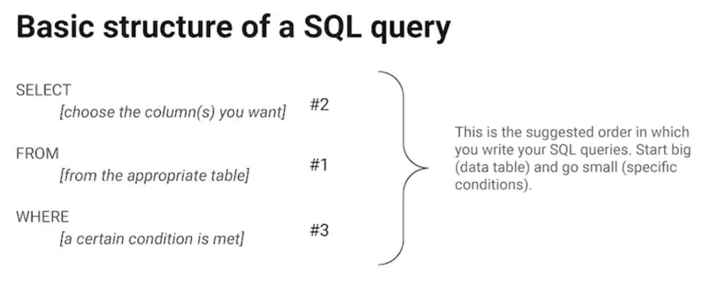

### 
 SQL em ação 

SQL pode fazer muitas das mesmas coisas como dados que as planilhas podem fazer. Pode ser usado para armazenar, organizar e analisar os dados, entre outras coisas.

* Uma consulta é uma solicitação de dados ou informações de um banco de dados.

Essa é a estrutura básica de consulta. 

### Guia SQL: Do início ao início 

**Consulta é uma solicitação de dados em um banco de dados.**  
**Sintaxe é a  estrutura predeterminada de uma linguagem que inclui todas as palavras, símbolos e pontuação exigidos.** 

`SELECT` para escolher as colunas que você deseja retornar. 
`FROM` para escolher as tabelas nas quais as colunas que você deseja estão localizadas.  
`WHERE` para filtrar determinadas informações.  

Outros conectores e/ou oepradores: `AND`, `OR`, `NOT`.

### Capitalização, recuo e ponto e vírgula 
Mantenha suas consultas organizadas e fica mais fácil revisá-las. O ponto e vírgula é um terminador de instrução e faz parte do padrão SQL-92, mas nem todos os bancos de dados adotam o ponto e vírgula. 
 `LIKE` é muito poderoso porque permite que você diga ao banco de dados para procurar um determinado padrão. O sinal de `%` é usado como caractere curinga para corresponder a um ou mais caracteres. Em alguns bancos de dados, é usado um `*` ao invés de `%`.  
 `SELECT *` para selecionar todas as colunas.  
 `/*Isso é um comentário*/` ou `-- isso é outro comentário`.  
  `Alias` facilita o trabalho usar alias nos nomes de colunas ou tabelas, por exemplo, `actual_table_name`.  
  