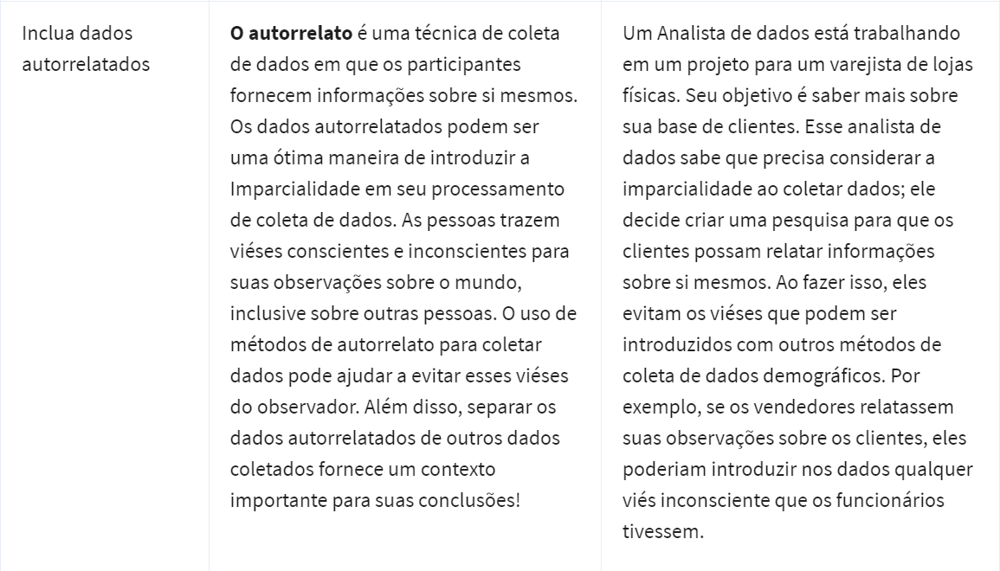
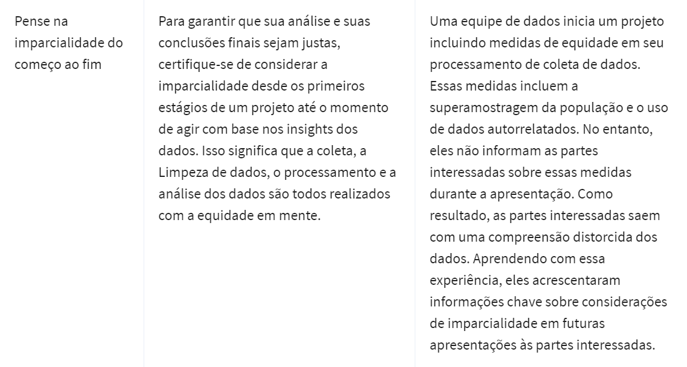
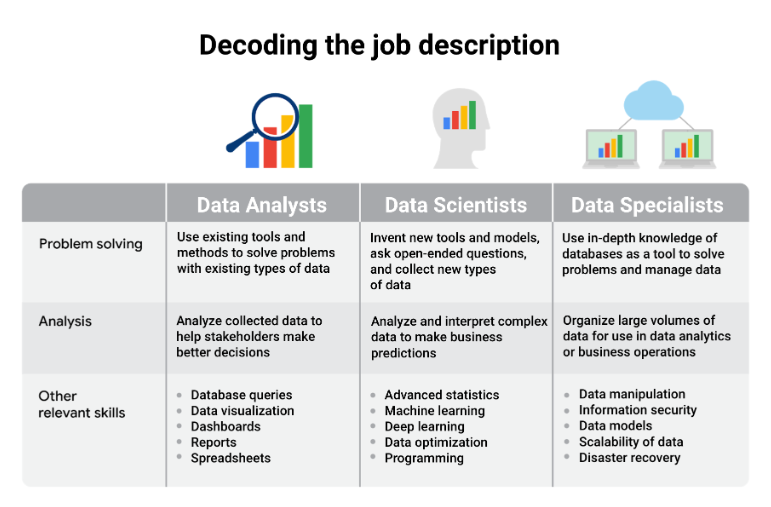

### 
 O poder dos dados nos negócios 

Um problema é um tópico ou assunto a ser investigado.  

Uma pergunta foi crada para descobrir informações.  

Um problema é um obstáculo que precisa ser resolvido.  

Uma tarefa de negócios é a pergunta ou problema que responde à análise de dados da empresa.  

Tomada de decisão baseada em dados ocorre quando fatos que foram descobertos por meio da análise de dados são usados para orientar a estratégia de negócios.  

Obesrvação e intuição são ferramentas poderosas na tomada de decisões.  

### Compreender os dados e a imparcialidade 

Outra responsabilidade muito importante, é garantir que suas análises sejam justas. 
*imparcialidade significa garantir que sua análise não crie nem reforce viés.*  

### Dicas 

- Pense em uma ocasião que você usou dados para resolver um problema, seja em seus projetos profissionais ou pessoais.  
- Aumentar sua rede profissional.  
- É muito imrpotante manter o LinkedIn e o GitHub atualizados, que você possa mostrar muitos projetos de analistas de dados que você fez.  
- Preparar perguntas para o entrevistador.  

